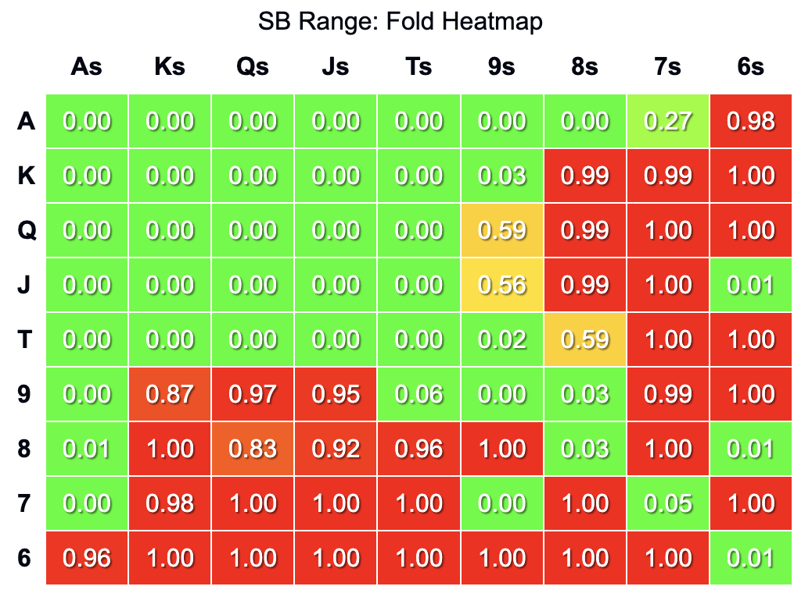

# ShortDeckNoLuckPoker


An implementation of Average Sampling Monte Carlo Counterfactual Regret Minimization (AS-MCCFR) for short deck Texas Hold'em poker.

## Project Description
This project implements the AS-MCCFR algorithm to compute Game Theory Optimal (GTO) strategies for heads-up Short Deck Poker. It aims to provide a robust poker AI and a tool for strategy analysis in this increasingly popular poker variant.

## Introduction
Short Deck Poker, also known as Six Plus Hold'em, is a variant of Texas Hold'em played with a 36-card deck. This project utilizes the AS-MCCFR algorithm, an advanced variation of Counterfactual Regret Minimization, to compute near-optimal strategies for this game. Our implementation currently offers both a playable AI opponent and a tool for generating ranges.

## Playing Against the AI
Currently, the game is played via a command-line interface. To start a game:

1. Clone the repository
2. Navigate to the project directory
3. Run `make run`

You will be prompted to input actions during gameplay. Enter an integer from 1-7, corresponding to the following actions:

| Input | Action                    |
|-------|---------------------------|
| 1     | Fold / Check              |
| 2     | Bet 0.50x pot / Raise 2.00x |
| 3     | Bet 0.75x pot / Raise 2.75x |
| 4     | Bet 1.00x pot / Raise 3.50x |
| 5     | Bet 2.00x pot / Raise 5.00x |
| 6     | All-in                    |
| 7     | Call                      |

## Range Generation
The program can generate output its ranges for any position/action in the game. For example, here is its SB preflop fold range:



To generate custom ranges, you can use the `GameState::print_range()` function. We are working on making this feature more user-friendly in future updates.

## Installation
```bash
git clone https://github.com/yourusername/ShortDeckNoLuckPoker.git
cd ShortDeckNoLuckPoker
make
```

## Requirements
C++ compiler with C++11 support
Make

## Contributing
Contributions are welcome! Please feel free to submit a Pull Request.

## License
This project is licensed under the MIT License - see the [LICENSE.md](LICENSE.md) file for details.

## Authors

[Glen Cahilly](https://github.com/gmc17)

## Acknowledgments
- [Efficient Monte Carlo Counterfactual Regret Minimization in Games with Many Player Actions](https://proceedings.neurips.cc/paper_files/paper/2012/file/3df1d4b96d8976ff5986393e8767f5b2-Paper.pdf) by Lanctot et al.
- [Speeding-Up Poker Game Abstraction Computation: Average Rank Strength](https://cdn.aaai.org/ocs/ws/ws1014/7083-30526-1-PB.pdf) by Johanson et al.
